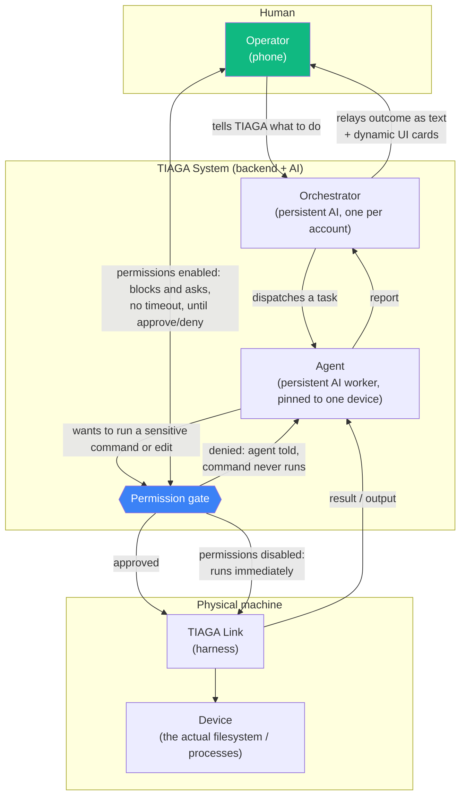
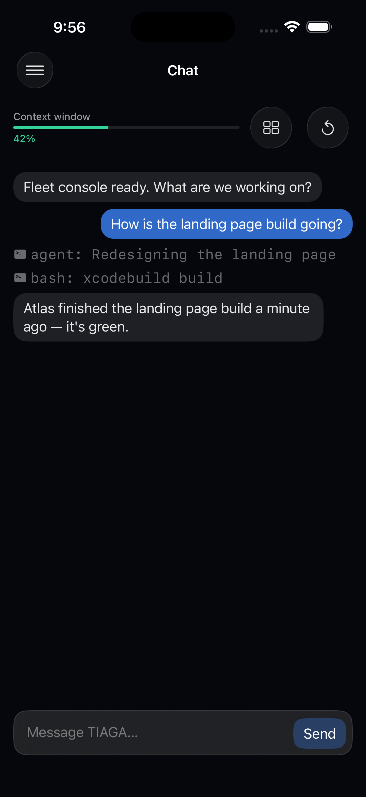
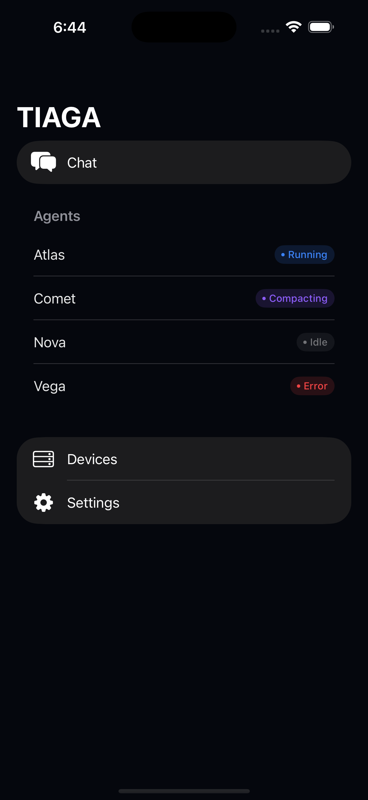
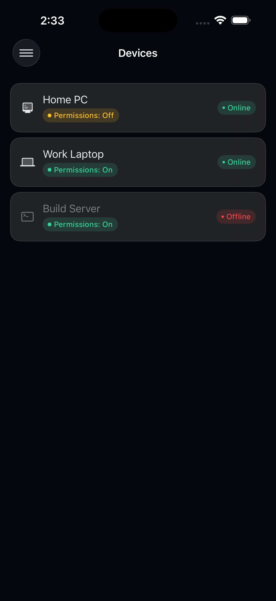
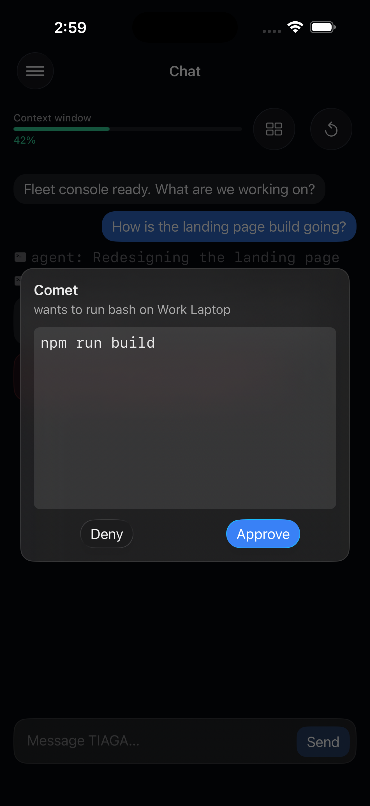
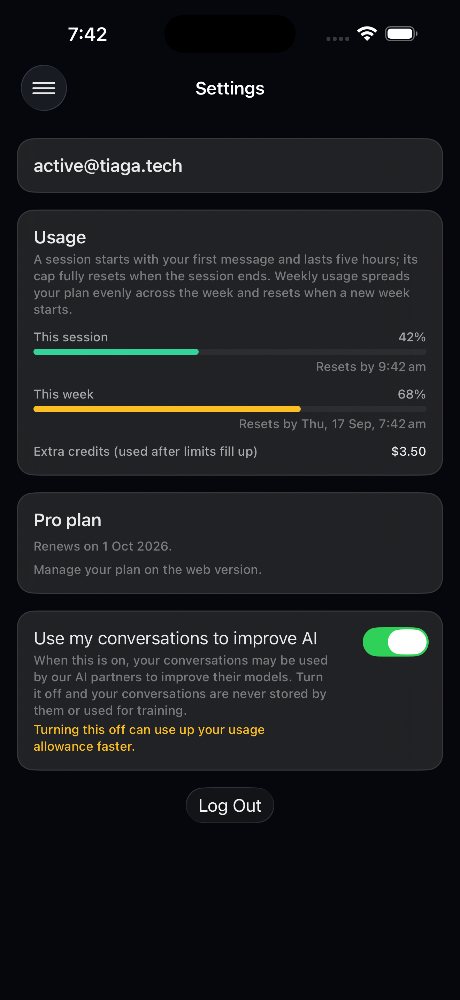

# TIAGA Mobile — Fleet Operations Console

The iOS companion app for [TIAGA](https://tiaga.tech), a multi-machine AI
control center that dispatches persistent AI coding agents onto a user's
fleet of desktops, laptops, and servers. You talk to TIAGA itself
voice-first on the web app, and it spawns and directs agents onto whichever
of your machines are connected; **TIAGA Link**, the piece that actually runs
on each machine, is only a harness — it has no interface of its own and
does nothing standalone. It just makes that machine available as a device
for TIAGA to dispatch agents onto, from either the web app or this one. This
app is the console you reach for **away from those machines** — check
whether a build finished, approve or deny a sensitive command an agent
wants to run, kill a runaway process, see which devices are online, all
from your phone.

This is also a university iOS assessment (a domain-centred MVP +
architecture piece), but it's built to the standard the real product
deserves — real auth flow, the real account/billing model, real business
rules, wired against TIAGA's actual production backend, not an invented demo
API.

## Before you start: connect a device

**Without a device connected to your account, this app is just an LLM chat
wrapper.** TIAGA's entire premise is dispatching agents onto *your own
machines* to do real work — write code, run builds, manage processes — so
the orchestrator has nothing to actually direct until at least one device is
online.

To connect one:

1. Install **TIAGA Link** (the desktop harness) on a Mac, Windows, or Linux
   machine — download it from the TIAGA web app or `tiaga.tech/download`.
2. In the TIAGA web app's device management, generate a device token. The
   raw token is shown once.
3. Paste that token into TIAGA Link and connect. The machine appears as a
   device in both the web app and this mobile app within a few seconds.

Only after that will spawning an agent, running a permission-gated command,
or seeing a device go online/offline in this app correspond to something
actually happening on a real machine.

## Architecture

Domain-centred MVVM with a required Use Case layer, matching the real
product's own domain vocabulary (`Device`, `Agent`, `PermissionRequest`,
`Account` — see [`AGENTS.md`](AGENTS.md) for the full domain model):

```
SwiftUI Views        Presentation/Views/<Feature>/
ViewModels (MVVM)     Presentation/ViewModels/
Use Cases             UseCases/                    — business operations
Domain                Domain/Models/, Domain/Repositories/ (protocols), Domain/Errors/
Data                  Data/Repositories/            — Fake* and Remote* implementations
```

Views never call a repository directly and never contain business rules —
they call a ViewModel, which calls a Use Case, which enforces a business
rule against a `Domain/Repositories` protocol. Every significant operation
(approving a permission request, sending a chat message, cancelling an
agent's task) is its own `...UseCase` with a typed, operator-facing error
enum — see [`TODO.md`](TODO.md) for the full build history and the
reasoning behind each one.

### Live backend

Every repository has two implementations: `Fake*Repository` (fixture data,
used **only** inside Xcode Previews, so the canvas stays fast and never
touches the network or a real account) and `Remote*Repository` (the real
backend at `https://tiaga.tech`, used everywhere else — Simulator or a real
device). **Running this app on Simulator or a device talks to your real
TIAGA account**: a chat message reaches a real LLM at real cost, an approved
permission runs a real command on a real machine. See `AGENTS.md`'s "Live
backend" section for the full policy.

## Human-System Architecture

The one place in this app where the system deliberately stops and waits on
a human decision is a **permission request**: before an agent runs a
sensitive command or edits a file on a device with permissions enabled, the
orchestrator blocks — indefinitely, no timeout — until the operator
explicitly approves or denies it from this app.



The permission gate is the human-system boundary: everything on the System
side of it, the AI decided and acted on its own; the loop back out to the
Human side is the one point a decision can interrupt that — and only when
permissions are enabled for that device, since disabling them is a
deliberate operator choice to trust that machine's agents fully. That's why
the approval overlay is
non-dismissable and has no auto-deny timeout (confirmed directly against the
real backend's `PermissionManager` — it blocks the call indefinitely, not
for some fixed window): a silently-lost approval request would mean an agent
either stalls forever or a human loses the one checkpoint they had over a
sensitive action.

## Screens

<table>
<tr>
<td><br><sub>Chat</sub></td>
<td><br><sub>Side menu</sub></td>
<td><br><sub>Devices</sub></td>
<td><br><sub>Permissions</sub></td>
<td><br><sub>Settings</sub></td>
</tr>
</table>

## Building & running

Requires Xcode with the iOS 26 SDK (deployment target 26.2).

```bash
open TIAGA/TIAGA.xcodeproj
```

Build and run the `TIAGA` scheme on an iPhone Simulator or a real device.
Signing in uses your real TIAGA account (private beta — an uninvited signup
lands on a waitlist gate, not the fleet console).

## Testing

```bash
xcodebuild test -project TIAGA/TIAGA.xcodeproj -scheme TIAGA \
  -destination 'platform=iOS Simulator,name=<simulator name>'
```

Unit tests (`TIAGATests`) cover every Use Case's business rules — happy
path, boundary conditions, and each error case — against purpose-built fake
repositories, independent of whether the running app itself is live-wired.

## Project docs

- [`AGENTS.md`](AGENTS.md) — canonical architecture, domain vocabulary, and
  design-system rules; read this before changing app code.
- [`TODO.md`](TODO.md) — the ordered build plan, with every section's
  "Revision" notes on what shipped differently from the original plan and
  why, including the live-backend wiring pass against the real API.
